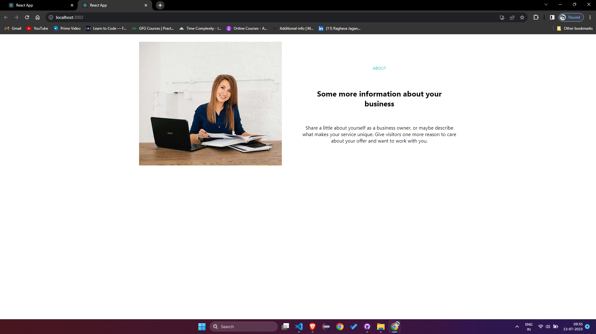

#Comet Labs

This is a landing page based on the Multor template. It showcases a modern, visually appealing design with a responsive layout and outstanding UI/UX.

## Live Demo

You can access the live demo of the Multor landing page 

## Video Demo

You can watch the video demonstration of the Multor landing page by clicking the link below:

**[CometLabs Assignment Landing Page Demo Video](

Click the link to view the video.
## Description

The Multor landing page is designed for developers with designer minds. It aims to attract talented developers and highlight the company's commitment to creativity and innovation.

## Features

- Sleek and modern design
- Fully responsive layout
- Creative use of Material-UI components
- Smooth scrolling and navigation
- Interactive sections and animations

## Technologies Used

- React.js
- Next.js
- Tailwind CSS

## Getting Started

To run the project locally, follow these steps:

1. Clone the repository:

   ```bash
   git clone
   ```

2. Navigate to the project directory:

   ```bash
   cd CometLabs
   ```

3. Install the dependencies:

   ```bash
   npm install
   ```

4. Run the development server:

   ```bash
   npm run dev
   ```

5. Open your browser and go to `http://localhost:3000` to view the landing page.

## Screenshots

Here are some screenshots of the Multor landing page:




## Deployment


